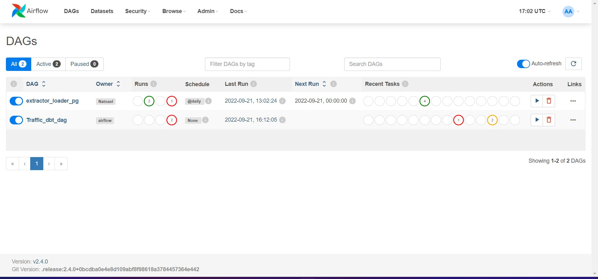

[](https://choosealicense.com/licenses/mit/)
# Data Engineering: Data warehouse tech stack with Postgres, DBT, and Airflow

You and your colleagues have joined to create an AI startup that deploys sensors to businesses, collects data from all activities in a business - people’s interaction, traffic flows, smart appliances installed in a company. Your startup helps organizations obtain critical intelligence based on public and private data they collect and organize. 

A city traffic department wants to collect traffic data using swarm UAVs (drones) from a number of locations in the city and use the data collected for improving traffic flow in the city and for a number of other undisclosed projects. Your startup is responsible for creating a scalable data warehouse that will host the vehicle trajectory data extracted by analysing footage taken by swarm drones and static roadside cameras.

The data warehouse should take into account future needs, organise data such that a number of downstream projects query the data efficiently. You should use the Extract Load Transform (ELT) framework using DBT.  Unlike the Extract, Transform, Load (ETL), the ELT framework helps analytic engineers in the city traffic department setup transformation workflows on a need basis.  

___

This project tried to implement the following core tasks
- A “data warehouse” (PostgresQL)
- An orchestration service (Airflow)
- An ELT tool (dbt)
___

## Deployment

> To deploy this project <br>`docker and docker-compose are required`

```bash
  git clone https://github.com/Nathnael12/DataEngineering_Datawarehouse_airflow.git
  cd DataEngineering_Datawarehouse_airflow
  pip install -r requirements.txt
  cd airflow
  docker-compose up airflow-init
  docker-compose up

#   after this you can find airflow webserver at localhost:8080
#  you can either manually trig tasks or you can turn dags on to start scheduled tasks
```
Please, find the deployed dbt warehouse documentation from [here](https://data-engineering-dwh.netlify.app/#!/overview)


## Screenshots
Two Dags


Acyclic Graph representation


DBT docs


Simple lineage


## Tech Stack

- Airflow
- Postgres
- DBT
- Docker


## Authors

- [@Nathnael12](https://www.github.com/nathnael12)


## Contributing

Contributions are always welcome!


Please adhere to this project's `code of conduct`.


## Feedback

If you have any feedback, please reach out to me at natnaelmasresha@gmail.com


